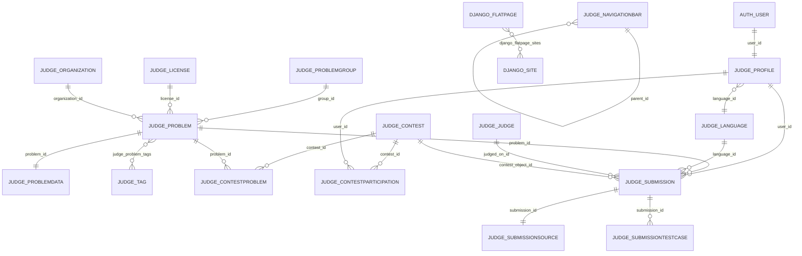

# ThinkAlgo OJ — cấu trúc database

Tài liệu này mô tả schema database Django/DMOJ của ThinkAlgo OJ và cách các
bảng liên kết với nhau. Bản mô tả được đối chiếu với database local `dmoj`
đang chạy trong `docker-compose.local.yml`.

> **Snapshot:** 2026-10-09  
> **Engine:** MariaDB 11.4.13  
> **Database charset:** `utf8mb4` / `utf8mb4_uca1400_ai_ci`

## 1. Tổng quan schema

| Hạng mục | Giá trị |
| --- | ---: |
| Số bảng | 98 |
| Số cột | 629 |
| Storage engine | 98/98 bảng InnoDB |
| Primary key | 98 |
| Index tổng cộng | 303 |
| Unique index | 79 |
| Foreign key | 130 |
| Check constraint | 21 |
| Dung lượng hiện tại | khoảng 4.98 MB |

Toàn bộ foreign key đang dùng `ON DELETE RESTRICT` và `ON UPDATE RESTRICT`.
Vì vậy dữ liệu cha (user, problem, contest...) không thể xóa nếu vẫn còn dữ
liệu con tham chiếu.

Các bảng được chia thành:

- `judge_*`: 73 bảng nghiệp vụ online judge;
- `auth_*`: 6 bảng xác thực Django;
- `django_*`: 8 bảng Django core và hệ thống site/flatpage;
- `social_auth_*`: 5 bảng OAuth/social login;
- `registration_*`, `reversion_*`, `impersonate_*`, `urlshortener_*`: các module
  phụ trợ.

## 2. Mô hình quan hệ chính



## 3. Bảng xác thực và người dùng

### `auth_user`

Bảng tài khoản Django chuẩn.

| Cột quan trọng | Ý nghĩa |
| --- | --- |
| `id` | Primary key |
| `username` | Tên đăng nhập, unique |
| `password` | Password hash, không lưu plaintext |
| `is_active` | Cho phép đăng nhập |
| `is_staff` | Có quyền truy cập admin |
| `is_superuser` | Bỏ qua kiểm tra permission |
| `email`, `first_name`, `last_name` | Thông tin tài khoản |
| `last_login`, `date_joined` | Thời điểm hoạt động/khởi tạo |

Các bảng nối `auth_group_permissions`, `auth_user_groups` và
`auth_user_user_permissions` triển khai group/permission của Django.

### `judge_profile`

Mở rộng `auth_user` theo quan hệ one-to-one thông qua `user_id` unique.

- Thống kê OJ: `points`, `performance_points`, `problem_count`, `rating`;
- Hiển thị: `username_display_override`, `display_rank`, `site_theme`,
  `ace_theme`, `math_engine`;
- Bảo mật: `is_totp_enabled`, `totp_key`, `is_webauthn_enabled`,
  `scratch_codes`, `api_token`;
- Quyền/trạng thái: `is_unlisted`, `mute`, `allow_tagging`, `ban_reason`;
- Liên kết: `language_id`, `current_contest_id`, `display_badge_id`, `user_id`.

### Các bảng người dùng phụ trợ

- `judge_badge`: badge của người dùng;
- `judge_profile_badges`: quan hệ nhiều-nhiều profile–badge;
- `judge_profile_organizations`: profile tham gia organization;
- `judge_rating`: rating theo contest;
- `judge_webauthncredential`: credential WebAuthn;
- `registration_registrationprofile`, `registration_supervisedregistrationprofile`:
  activation và supervised registration.

## 4. Problem, tag và problem data

### `judge_problem`

Bảng trung tâm của bài toán.

| Nhóm cột | Cột |
| --- | --- |
| Định danh | `id`, `code`, `name` |
| Nội dung | `description`, `summary`, `source`, `pdf_url`, `og_image` |
| Chấm điểm | `time_limit`, `memory_limit`, `points`, `partial`, `short_circuit` |
| Hiển thị | `is_public`, `is_organization_private`, `deleted_at` |
| Thống kê | `user_count`, `ac_rate`, `date` |
| Liên kết | `group_id`, `license_id`, `organization_id` |
| Visibility | `submission_source_visibility_mode`, `testcase_visibility_mode`,
  `testcase_result_visibility_mode`, `allow_view_feedback` |

### `judge_problemdata`

Quan hệ one-to-one với `judge_problem` qua `problem_id` unique. Lưu dữ liệu
chấm và file problem:

- archive/generator: `zipfile`, `generator`;
- checker/grader: `checker`, `checker_args`, `custom_checker`, `custom_grader`,
  `custom_header`, `grader`, `grader_args`;
- giới hạn: `output_prefix`, `output_limit`, `zipfile_size`;
- tùy chọn: `nobigmath`, `unicode`;
- phát hành R2: `r2_release_key`, `r2_release_sha256`,
  `r2_release_version`, `r2_released_at`.

### Bảng problem liên quan

- `judge_problemgroup`: nhóm bài;
- `judge_problemtype`: loại bài;
- `judge_license`: license;
- `judge_problemtranslation`: bản dịch đề;
- `judge_problemtestcase`: test case;
- `judge_problemclarification`: clarification của bài;
- `judge_problem_allowed_languages`: bài–ngôn ngữ được phép;
- `judge_problem_authors`, `judge_problem_curators`, `judge_problem_testers`,
  `judge_problem_banned_users`: các quan hệ profile với bài;
- `judge_problem_tags`, `judge_problem_types`: quan hệ bài–tag/type;
- `judge_tag`, `judge_taggroup`, `judge_tagproblem`, `judge_tagdata`: hệ thống
  tag và dữ liệu tag.

## 5. Contest

### `judge_contest`

Bảng contest gồm 45 cột, bao gồm:

- định danh: `key`, `name`, `description`;
- thời gian: `start_time`, `end_time`, `registration_start`,
  `registration_end`, `locked_after`;
- trạng thái: `is_visible`, `is_rated`, `is_private`, `is_organization_private`,
  `disallow_virtual`;
- scoreboard: `scoreboard_visibility`, `scoreboard_cache_timeout`,
  `points_precision`, `frozen_last_minutes`, `show_submission_list`;
- format: `format_name`, `format_config`, `problem_label_script`;
- quyền/mã truy cập: `access_code`, `ranking_access_code`, `terms`;
- liên kết: `organization_id`.

### Bảng liên quan đến contest

- `judge_contestproblem`: contest–problem, thứ tự bài và điểm;
- `judge_contestparticipation`: user tham gia contest, trạng thái và thời gian;
- `judge_contestsubmission`: dữ liệu submission theo contest;
- `judge_contestannouncement`: thông báo contest;
- `judge_contesttag`: tag contest;
- `judge_contestmoss`: kết quả MOSS;
- `judge_contest_authors`: contest–author;
- `judge_contest_curators`: contest–curator;
- `judge_contest_testers`: contest–tester;
- `judge_contest_private_contestants`: danh sách contestant private;
- `judge_contest_banned_users`, `judge_contest_banned_judges`: danh sách bị cấm;
- `judge_contest_rate_exclude`: user loại khỏi rating;
- `judge_contest_tags`: contest–tag;
- `judge_contest_view_contest_scoreboard`: quyền xem scoreboard.

Các bảng nối nhiều-nhiều thường có `contest_id`, `profile_id` hoặc `tag_id` và
unique constraint trên cặp khóa để ngăn bản ghi trùng.

## 6. Submission và judge worker

### `judge_submission`

Mỗi dòng là một lần nộp bài.

- định danh/thời gian: `id`, `date`, `judged_date`, `rejudged_date`;
- kết quả: `status`, `result`, `points`, `time`, `memory`, `error`;
- tiến trình test: `current_testcase`, `case_points`, `case_total`, `batch`,
  `is_pretested`;
- liên kết: `user_id`, `problem_id`, `language_id`, `judged_on_id`,
  `contest_object_id`;
- lock: `locked_after`.

### Bảng con của submission

- `judge_submissionsource`: source code, one-to-one với submission;
- `judge_submissiontestcase`: kết quả từng testcase, unique theo
  `(submission_id, case)`;
- `judge_contestsubmission`: dữ liệu mở rộng khi submission thuộc contest.

### Judge worker

- `judge_judge`: worker, auth key, online/blocked/disabled, load và ping;
- `judge_judge_problems`: worker–problem;
- `judge_judge_runtimes`: worker–runtime;
- `judge_language`: ngôn ngữ biên dịch/chạy;
- `judge_languagelimit`: giới hạn ngôn ngữ theo problem;
- `judge_runtimeversion`: version runtime.

Luồng dữ liệu chấm bài:

```text
auth_user
  -> judge_profile
  -> judge_submission
       -> judge_submissionsource
       -> judge_submissiontestcase
       -> judge_problem
       -> judge_language
       -> judge_judge
```

## 7. Organization

### `judge_organization`

Tổ chức dùng để phân vùng user, problem và contest. Các bảng liên quan:

- `judge_organization_admins`: administrator của organization;
- `judge_organizationrequest`: yêu cầu tham gia;
- `judge_organizationquota`: quota lưu trữ/tài nguyên;
- `judge_organizationmonthlyusage`: usage theo tháng;
- `judge_organizationproblemtag`: tag problem trong organization.

`judge_problem.organization_id` và `judge_contest.organization_id` cho phép
problem/contest thuộc một organization; giá trị có thể null với dữ liệu public
toàn hệ thống.

## 8. Navbar, FlatPage và cấu hình site

### `judge_navigationbar`

Bảng MPTT lưu navbar dạng cây:

- `parent_id`: liên kết node cha;
- `lft`, `rght`, `tree_id`, `level`: chỉ mục MPTT;
- `order`, `key`, `label`, `path`, `regex`: thứ tự, nhãn, URL và rule active.

Hiện local có 8 node: Problems, Submissions, Users, Contests, About, Judges,
Custom Checkers và Github.

### Django site/flatpage

- `django_site`: domain hiện tại của Django Sites framework;
- `django_flatpage`: nội dung markdown/html theo `url`;
- `django_flatpage_sites`: quan hệ nhiều-nhiều flatpage–site;
- `django_redirect`: redirect tùy chỉnh;
- `judge_miscconfig`: các key/value cấu hình OJ.

`/about/` và `/custom_checkers/` được phục vụ bởi FlatPages, không phải route
view cứng trong `dmoj/urls.py`.

## 9. Blog, comment, ticket và tiện ích

- Blog: `judge_blogpost`, `judge_blogposttag`, `judge_blogpost_authors`,
  `judge_blogpost_tags`, `judge_blogvote`;
- Comment: `judge_comment`, `judge_commentlock`, `judge_commentvote`;
- Ticket: `judge_ticket`, `judge_ticketmessage`, `judge_ticket_assignees`;
- Issue tổng quát: `judge_generalissue`;
- Notification: `judge_notification`;
- `judge_solution`, `judge_solution_authors`: editorial/solution của problem;
- `judge_organization*`: dữ liệu tổ chức như mô tả ở trên.

Một số module dùng generic relation thông qua `django_content_type` và
`object_id`, vì vậy cần giữ bản ghi content type tương ứng khi backup/restore.

## 10. Bảng hệ thống Django

- `django_migrations`: lịch sử migration đã chạy;
- `django_content_type`: ánh xạ app/model cho permission và generic relation;
- `django_admin_log`: audit log Django admin;
- `django_session`: session đăng nhập;
- `auth_permission`, `auth_group*`: permission/group;
- `social_auth_*`: association, code, nonce, partial và social user;
- `reversion_revision`, `reversion_version`: lịch sử revision;
- `impersonate_impersonationlog`: log impersonation;
- `urlshortener_urlshortener`: URL rút gọn.

## 11. Column inventory của các bảng lõi

Ký hiệu `!` nghĩa là `NOT NULL`, `?` nghĩa là nullable. Các bảng dưới đây là
những bảng trực tiếp tham gia vào luồng đăng nhập, tạo problem, contest, submit
và chấm bài.

| Bảng | Cột vật lý |
| --- | --- |
| `auth_user` | `id int!`, `password varchar(128)!`, `last_login datetime?`, `is_superuser bool!`, `username varchar(150)!`, `first_name varchar(150)!`, `last_name varchar(150)!`, `email varchar(254)!`, `is_staff bool!`, `is_active bool!`, `date_joined datetime!` |
| `judge_profile` | `id int!`, `about longtext?`, `timezone varchar(50)!`, `points double!`, `performance_points double!`, `problem_count int!`, `ace_theme varchar(30)!`, `last_access datetime!`, `ip char(39)?`, `display_rank varchar(10)!`, `mute bool!`, `is_unlisted bool!`, `rating int?`, `user_script longtext!`, `math_engine varchar(4)!`, `is_totp_enabled bool!`, `totp_key longblob?`, `notes longtext?`, `current_contest_id int?`, `language_id int!`, `user_id int!`, `api_token varchar(64)?`, `is_webauthn_enabled bool!`, `data_last_downloaded datetime?`, `scratch_codes longblob?`, `contribution_points int!`, `allow_tagging bool!`, `last_totp_timecode int!`, `ban_reason longtext?`, `username_display_override varchar(100)!`, `display_badge_id int?`, `site_theme varchar(10)!`, `vnoj_points int!`, `ip_auth char(39)?` |
| `judge_problem` | `id int!`, `code varchar(32)!`, `name varchar(100)!`, `description longtext!`, `time_limit double!`, `memory_limit int!`, `short_circuit bool!`, `points double!`, `partial bool!`, `is_public bool!`, `is_manually_managed bool!`, `date datetime?`, `og_image varchar(150)!`, `summary longtext!`, `user_count int!`, `ac_rate double!`, `is_organization_private bool!`, `group_id int!`, `license_id int?`, `is_full_markup bool!`, `pdf_url varchar(200)!`, `source varchar(200)!`, `submission_source_visibility_mode varchar(1)!`, `testcase_visibility_mode varchar(1)!`, `allow_view_feedback bool!`, `testcase_result_visibility_mode varchar(1)!`, `organization_id int?`, `deleted_at datetime?` |
| `judge_problemdata` | `id int!`, `zipfile varchar(100)?`, `generator varchar(100)?`, `output_prefix int?`, `output_limit int?`, `feedback longtext!`, `checker varchar(10)!`, `checker_args longtext!`, `problem_id int!`, `custom_checker varchar(100)?`, `custom_grader varchar(100)?`, `custom_header varchar(100)?`, `grader varchar(30)!`, `grader_args longtext!`, `nobigmath bool?`, `unicode bool?`, `zipfile_size bigint!`, `r2_release_key varchar(255)!`, `r2_release_sha256 varchar(64)!`, `r2_release_version varchar(64)!`, `r2_released_at datetime?` |
| `judge_contest` | `id int!`, `key varchar(32)!`, `name varchar(100)!`, `description longtext!`, `start_time datetime!`, `end_time datetime!`, `time_limit bigint?`, `is_visible bool!`, `is_rated bool!`, `use_clarifications bool!`, `rate_all bool!`, `is_private bool!`, `hide_problem_tags bool!`, `run_pretests_only bool!`, `og_image varchar(150)!`, `logo_override_image varchar(150)!`, `user_count int!`, `summary longtext!`, `access_code varchar(255)!`, `format_name varchar(32)!`, `format_config longtext?`, `rating_ceiling int?`, `rating_floor int?`, `is_organization_private bool!`, `problem_label_script longtext!`, `points_precision int!`, `scoreboard_visibility varchar(1)!`, `virtual_count int!`, `locked_after datetime?`, `hide_problem_authors bool!`, `csv_ranking longtext!`, `show_short_display bool!`, `push_announcements bool!`, `frozen_last_minutes int!`, `show_submission_list bool!`, `scoreboard_cache_timeout int unsigned!`, `data_last_downloaded datetime?`, `disallow_virtual bool!`, `ranking_access_code varchar(255)!`, `registration_end datetime?`, `registration_start datetime?`, `rate_disqualified bool!`, `organization_id int?`, `terms longtext!`, `replay_version int unsigned!` |
| `judge_submission` | `id int!`, `date datetime!`, `time double?`, `memory double?`, `points double?`, `status varchar(2)!`, `result varchar(3)?`, `error longtext?`, `current_testcase int!`, `batch bool!`, `case_points double!`, `case_total double!`, `is_pretested bool!`, `judged_on_id int?`, `language_id int!`, `problem_id int!`, `user_id int!`, `contest_object_id int?`, `judged_date datetime?`, `locked_after datetime?`, `rejudged_date datetime?` |
| `judge_submissionsource` | `id int!`, `source longtext!`, `submission_id int!` |
| `judge_submissiontestcase` | `id int!`, `case int!`, `status varchar(3)!`, `time double?`, `memory double?`, `points double?`, `total double?`, `batch int?`, `feedback varchar(50)!`, `extended_feedback longtext!`, `output longtext!`, `submission_id int!` |
| `judge_judge` | `id int!`, `name varchar(50)!`, `created datetime!`, `auth_key varchar(100)!`, `is_blocked bool!`, `online bool!`, `start_time datetime?`, `ping double?`, `load double?`, `description longtext!`, `last_ip char(39)?`, `is_disabled bool!`, `tier int unsigned!` |
| `judge_language` | `id int!`, `key varchar(10)!`, `name varchar(20)!`, `short_name varchar(10)?`, `common_name varchar(20)!`, `ace varchar(20)!`, `pygments varchar(20)!`, `template longtext!`, `info varchar(50)!`, `description longtext!`, `extension varchar(10)!`, `file_only bool!`, `file_size_limit int!`, `include_in_problem bool!` |
| `judge_navigationbar` | `id int!`, `order int unsigned!`, `key varchar(10)!`, `label varchar(20)!`, `path varchar(255)!`, `regex longtext!`, `lft int unsigned!`, `rght int unsigned!`, `tree_id int unsigned!`, `level int unsigned!`, `parent_id int?` |
| `django_flatpage` | `id int!`, `url varchar(100)!`, `title varchar(200)!`, `content longtext!`, `enable_comments bool!`, `template_name varchar(70)!`, `registration_required bool!` |

## 12. Trạng thái dữ liệu local tại thời điểm snapshot

| Bảng/dữ liệu | Số dòng |
| --- | ---: |
| `auth_user` | 2 |
| `judge_profile` | 2 |
| `judge_language` | 1 (Python 3) |
| `judge_navigationbar` | 8 |
| `django_flatpage` | 2 |
| `judge_problem` | 0 |
| `judge_contest` | 0 |
| `judge_submission` | 0 |
| `judge_judge` | 0 |
| `judge_organization` | 0 |
| `judge_problemdata` | 0 |

Database local hiện là database bootstrap sạch. Muốn thử đầy đủ luồng submit và
judge cần nạp thêm language fixtures, problem data và khởi chạy judge worker.

## 13. Migration và schema drift

Tại thời điểm kiểm tra:

- migration database đã apply đến `judge.0233_problemdata_r2_release`;
- `manage.py migrate --plan` không còn operation pending;
- `manage.py makemigrations --check --dry-run` vẫn phát hiện migration dự kiến
  `judge.0234`.

Migration dự kiến thay đổi metadata của các quan hệ author/curator/tester trong
contest và choices/default của `Profile.timezone`. Đây chủ yếu là state của
Django, không phải các cột nghiệp vụ mới, nhưng vẫn cần tạo và commit migration
để code model và migration history đồng bộ trước khi deploy production.

## 14. Kiểm tra schema hữu ích

Chạy từ thư mục repo:

```powershell
# Kiểm tra service và migration
docker compose -f docker-compose.local.yml ps
docker compose -f docker-compose.local.yml exec site python3 manage.py migrate --plan

# Kiểm tra model có thay đổi chưa tạo migration
docker compose -f docker-compose.local.yml exec site python3 manage.py makemigrations --check --dry-run

# Kiểm tra toàn bộ bảng MariaDB
docker compose -f docker-compose.local.yml exec db mariadb-check -uroot -proot --databases dmoj --check

# Xem DDL của một bảng
docker compose -f docker-compose.local.yml exec db mariadb -uroot -proot dmoj \
  -e "SHOW CREATE TABLE judge_submission\\G"
```

Không commit password database production vào tài liệu hoặc command history.
